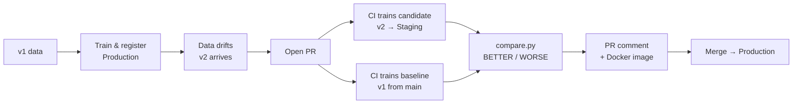

# Hi, I'm Aina Nadal 👋

Machine Learning & AI Engineer.

---

## Projects

### ⚙️ MLOps Churn Pipeline
**End-to-end MLOps pipeline for customer churn prediction**

Demonstrates production-grade ML practices: data versioning with DVC, remote experiment tracking on DagsHub, CI-driven model comparison on every PR, MLflow Model Registry lifecycle (Staging → Production), and Docker packaging.

Every pull request automatically trains a candidate model on new data (v2) and a baseline on the original data (v1), compares both, and posts a validation report with metric deltas and a BETTER / WORSE verdict as a PR comment.

  
  

  
  
  

**Stack:** Python · scikit-learn · MLflow · DVC · GitHub Actions · Docker · Cloudflare R2 · DagsHub

🔗 [View repository](https://github.com/ANadalCardenas/mlops-churn-pipeline) · [MLflow UI](https://dagshub.com/ANadalCardenas/mlops-churn-pipeline.mlflow) · [Showcase PR](https://github.com/ANadalCardenas/mlops-churn-pipeline/pull/4)

---

### 🛡️ Drowsiness Detection
**Real-time driver drowsiness detection using YOLOv5**

Detects whether a person appears awake or drowsy from webcam or image input. Includes a full training pipeline: dataset collection, annotation, and model training.

**Stack:** YOLOv5 · PyTorch · OpenCV · Docker · Label Studio

🔗 [View repository](https://github.com/ANadalCardenas/drowsiness_detection)

---

### 👤 Close Person Detection
**Proximity detection combining object detection and depth estimation**

Detects nearby people in a video stream and highlights individuals closer than a defined distance threshold. Useful for robotics safety, autonomous driving, and security surveillance.

https://github.com/user-attachments/assets/041c215a-568f-42db-915d-bff2ee476140

**Stack:** YOLO · Depth-Anything-V2 · Docker

🔗 [View repository](https://github.com/ANadalCardenas/close_person_detection)

---

### 🎙️ English Conversational Teacher
**AI-powered voice-based English practice assistant**

An interactive web application that helps users practice English through voice conversation. Provides instant sentence corrections, grammar explanations, context-aware follow-up questions, and a final learning summary.

  

  

  

**Stack:** FastAPI · OpenAI GPT · Whisper · Docker · Nginx

🔗 [View repository](https://github.com/ANadalCardenas/conversational_teacher_agent)
